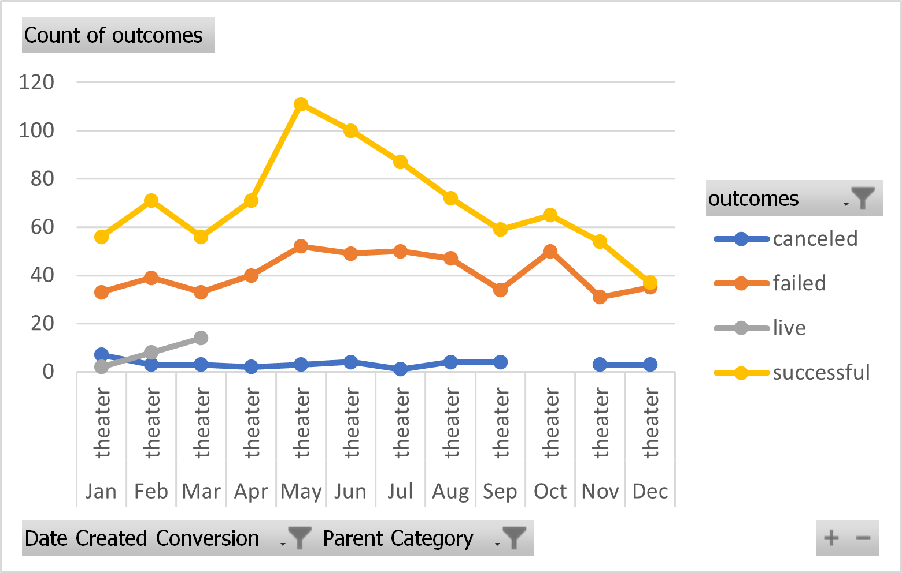
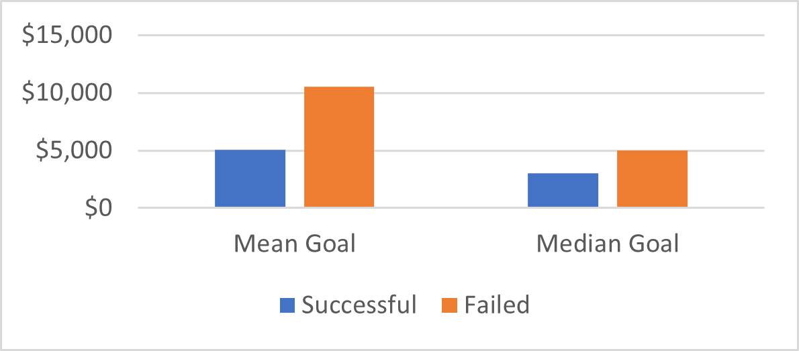
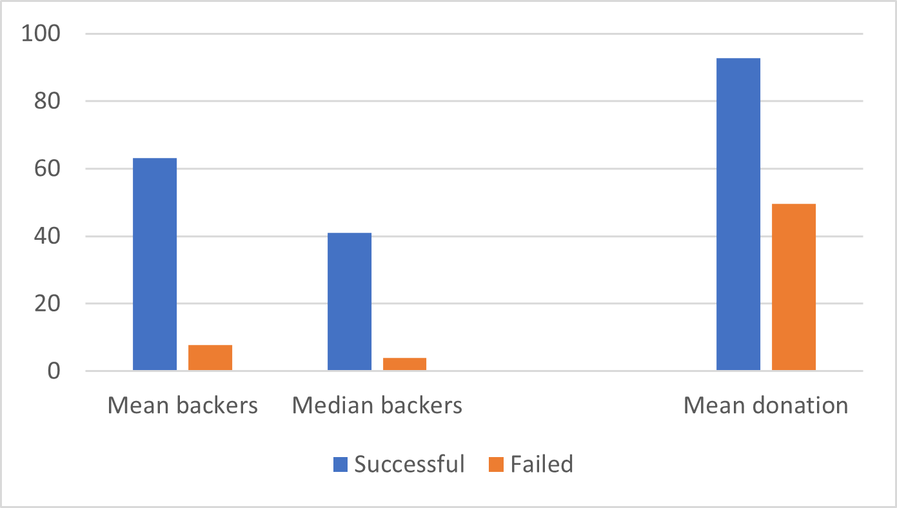
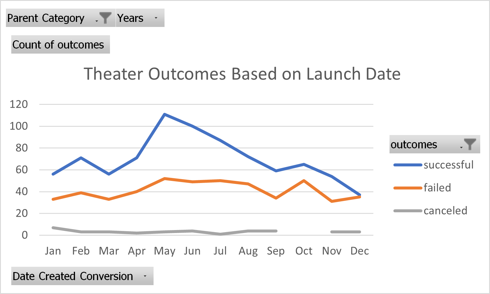
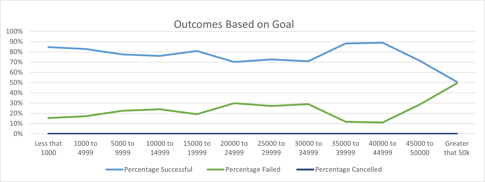

# A Kickstarter analysis for the Optimal Launch of Louise's Play
KS analysis to uncover trends
---
After looking over 4115 kickstarter projects for overall trends and then focusing on theater/play projects specifically.  Two items came up frequently for successful kickstarter campaigns.  They were one: Requesting money during the summer months, and two: Requesting a moderate amount of money.  
This graph illustrates the first point of timing being important for requests.
---

---
When more moderate amounts of money were requested, the donations were greater and more frequent.

---

---
---
# Kickstarter_challenge
# Kickstarting with Excel

## Overview of Project
The client's goal was to determine the most favorable times for her Kickstarter launch.
---
### Purpose
Analyze the data to spot any trends that may occur when comparing launch dates and launch success or failure.
---
## Analysis and Challenges
Results in this challenge were similar to the results found in the Original readme file for data-1-1-3-StarterBook.  Outcome based on goals was a new discovery.
---
### Analysis of Outcomes Based on Launch Date
Launch date appears to play a large part in the success of plays.  Those launched in the summer months are more successful.
---

---
### Analysis of Outcomes Based on Goals
This data came out a bit strange for me, it did show an apparently obvious correlation between successfull launches and increased funds.  Unsuccessful launches has measurably fewer funds sent to them.
---

---
### Challenges and Difficulties Encountered
So many, but really it all came down to attention to detail.  Where do the commas need to be?  The greater sign comes before equals.  Should there be a space or not.  Synchronizing cell values for various formulas.  I really learned a lot, for someone who thought they were ok at Excel.
---
## Results

- What are two conclusions you can draw about the Outcomes based on Launch Date?
Summer months are better times for a launch.  November to January are the least favorable months for Plays to launch successfully.
---
- What can you conclude about the Outcomes based on Goals?
This was an interesting one, because in the original data set, when the numbers were crunched it indicated "launchers" who asked for moderate amounts of money<=5000 did better than those who aimed high at >=10000.  This chart just seems to indicate that successful launches raised more money.  Which doesn't seem very useful.
---
- What are some limitations of this dataset?
It was interesting there were no "cancelled" plays.  I wonder how many of the plays came to fruition, not all successful kickstarter campaigns produce a product.  
---
- What are some other possible tables and/or graphs that we could create?
- I'm interested in the "staff pick" category.  People pay for prime position and advertising. I wonder if it made any difference in the success rate and if there was a change was it enough to couteract the effect of a bad launch time?
